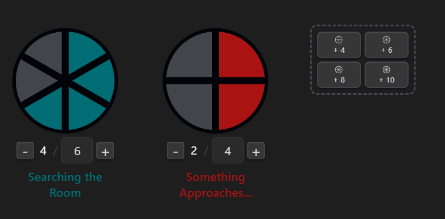

# RPG Clocks

Use Blades in the Dark style clocks for your RPG in Obsidian.



## Manual Installation

1. Download `main.js`, `manifest.json`, and `styles.css` from the [latest release](https://github.com/sbuffkin/rpg-clock/releases/latest).
2. In your vault, create the folder `.obsidian/plugins/rpg-clock/`.
3. Copy the three downloaded files into that folder.
4. In Obsidian, open **Settings → Community plugins**, find **Rpg Clock** in the list, and enable it.

---

## How to use

### Creating clocks

Use the **Insert Clock** command (command palette or right-click editor menu) to insert a clock block at the cursor, or add one manually:

````markdown
```clock
My Clock:0/6
```
````

Multiple lines in one block create multiple clocks side by side:

````markdown
```clock
Danger:2/4
Progress:0/8:#006d75
```
````

**Syntax:** `Name:filled/total[:color]`  — color is optional and overrides the global default.

### Clock controls

Each rendered clock has:

- **− / +** buttons to decrement or increment the filled segments
- **Filled / Total** display — the total field is editable to change the number of segments
- **Name field** — click to edit; press Enter or click away to save
- **Drag handle** (top-centre, visible on hover) — drag to reorder clocks within the block
- **Delete button** (top-right ×, visible on hover) — removes the clock
- **Color button** (bottom-right dot, visible on hover) — click to reveal the palette and pick a color

### Adding clocks

Each clock block has an **add button** rendered as a 2×2 grid. Each cell shows a preview of the clock shape and a section count — click **+ 4**, **+ 6**, **+ 8**, or **+ 10** to insert a new clock with that many segments. The name field is focused immediately so you can start typing straight away.

### Color palette

A set of preset colors is shown when you click the color dot on any clock. Click a swatch to apply it. The palette is configurable in settings.

---

## Settings

Open **Settings → RPG Clock** to configure:

| Setting | Description |
|---|---|
| **Clock Size** | Slider (60–300 px) controlling the diameter of all clocks. Clocks update live as you drag. |
| **Clock Color** | Default color applied to newly created clocks. |
| **Color Palette** | The set of quick-select colors shown on each clock. Drag swatches to reorder, click to edit, right-click to remove, or use the color picker at the bottom to add new ones. |

---

> - Thanks to [obsidian-sample-plugin](https://github.com/obsidianmd/obsidian-sample-plugin) for the base template
> - Thanks to [u/Seeonee](https://www.reddit.com/user/Seeonee/) who made https://rp.meromorph.com/blades/ for inspiration and design
